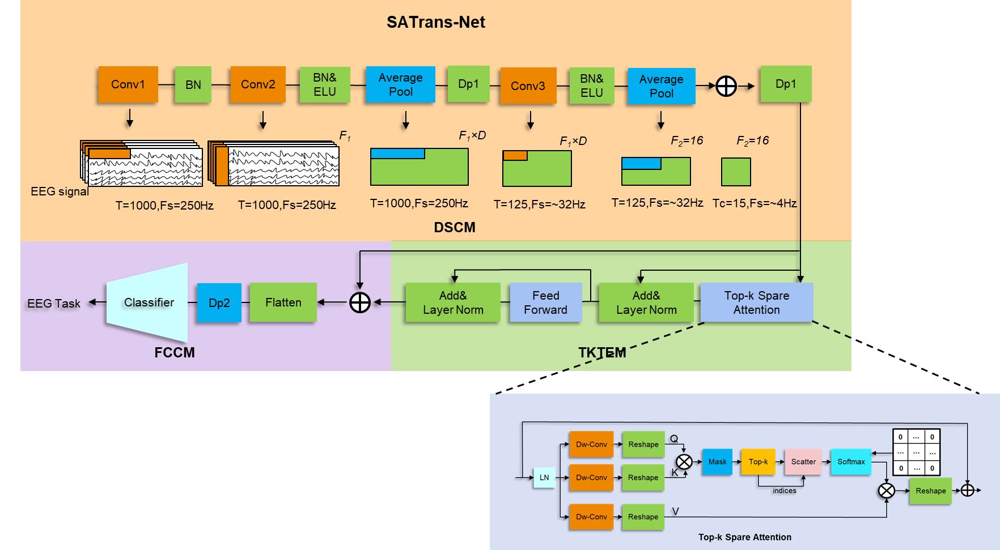

# SATrans-Net: Sparse Attention Transformer for EEG-based Motor Imagery Decoding

SATrans-Net is a deep learning model designed to improve the decoding performance of EEG signals. It combines the power of Convolutional Neural Networks (CNNs) and Transformers, integrating a Top-k Sparse Attention mechanism to efficiently capture long-sequence dependencies in EEG signals. The model consists of three main components: feature extraction using 2D separable convolution, a Transformer block with Top-k Sparse Attention, and a classification layer for final signal decoding.

---
## Features:
- **Feature Extraction Layer:** 🧠 Uses 2D separable convolutions to capture both time-domain and spatial-domain features from EEG signals.
- **Transformer with Top-k Sparse Attention:** ⚡ Incorporates Top-k sparse attention to efficiently model long-term dependencies while reducing computational complexity.
- **Classification Layer:** 🏆 Enhances classification accuracy and model generalization by leveraging optimized features.
- **State-of-the-art Performance:** 🚀 Achieves significant improvements in decoding accuracy compared to existing methods, particularly in EEG-related tasks.
---

## 🚀 **Highlights**

- **Novel Deep Learning Model**: Introduced SATrans-Net, a hybrid architecture combining CNN and Transformer with a Top-k sparse attention mechanism tailored for efficient EEG signal decoding.

- **Improved Long-Sequencing Modeling**: The integration of Top-k sparse attention in the Transformer module enables SATrans-Net to capture long-sequence dependencies in EEG data, addressing the challenges of handling complex temporal patterns.
  
---

## 📊 **Experimental Results**  

| Dataset         | Task                         | Accuracy (%) | 
|------------------|------------------------------|--------------|
| BCI IV-2a       | Within-Subject (Cross-Time)  | 84.72       | 
| BCI IV-2b       | Within-Subject (Cross-Time)  | 87.76       | 
| High-Gamma      | High-Frequency Signal Decoding | 96.76      | 

---

## 🌟 **Future Applications**  
SATrans-Net holds significant potential for:  
- **Brain-Computer Interfaces (BCI):** Improving communication and control systems for individuals with disabilities.  
- **Neurological Disease Monitoring:** Decoding neural activity for early disease detection and monitoring.  
- **Personalized Medicine:** Enabling adaptive and targeted healthcare solutions based on individual neural profiles.  

---

## 📷 **Visualization**  
   
> *Figure: Model architecture .*  

---

## 📂 **Repository Structure**  
- `models/` - Implementation of TFCA-Trans.  
- `results/` - This folder is reserved for experimental analysis scripts. Results are not uploaded.  
- `README.md` - Project documentation and overview.  

---

## 📊 **Data Access**  
The datasets used in this study can be accessed from the following sources:  
- **BCI IV-2a:** [Competition Dataset](https://www.bbci.de/competition/iv/)  
- **BCI IV-2b:** [Competition Dataset](https://www.bbci.de/competition/iv/)  
- **High-Gamma Dataset:** [MOABB Documentation](https://braindecode.org/stable/generated/braindecode.datasets.HGD.html)

### **Data Preprocessing**  
For preprocessing steps and details, please refer to my paper.

---

## 📝 **Paper Title**  
> *[SATrans-Net: Sparse Attention Transformer for EEG-based motor imagery decoding]*  
> 📄 [DOI: 10.1038/s41598-025-30806-8 ](https://doi.org/10.1038/s41598-025-30806-8)

---
## 🛠 **Usage Instructions**  
This repository provides a clear and organized structure for using SATrans-Net. Below is an overview of the main scripts to help you get started:

```plaintext
code/
├── modelt.py   # Implementation of the SATrans-Net model
├── experiment.py      # Includes data loading and training scripts
├── utils.py           # Contains utility functions necessary for the workflow
└── main.py            # Entry point for executing the code
```
To run the model, simply execute the main.py script, which ties all the components together:
python code/main.py
If you encounter any issues or have questions, feel free to reach out. 😊


---

**✨ Explore the potential of SATrans-Net and join the journey of advancing EEG decoding! ✨**
